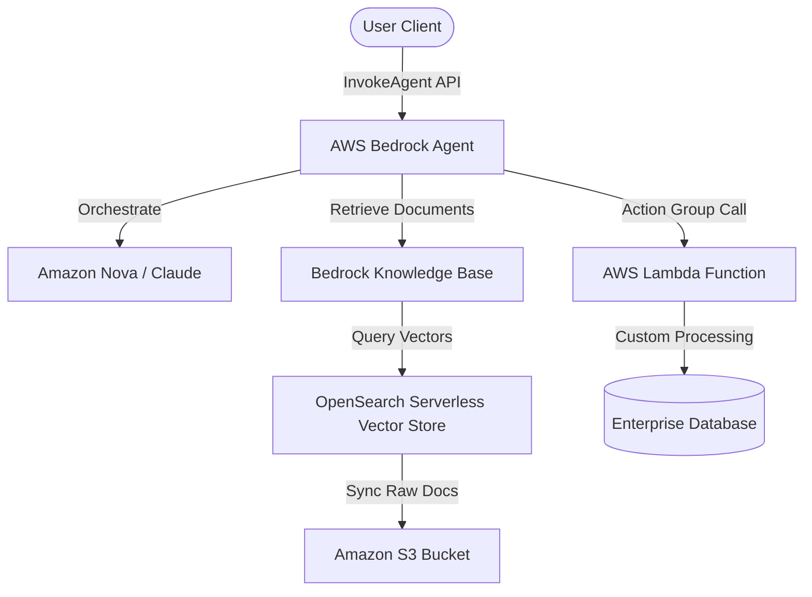
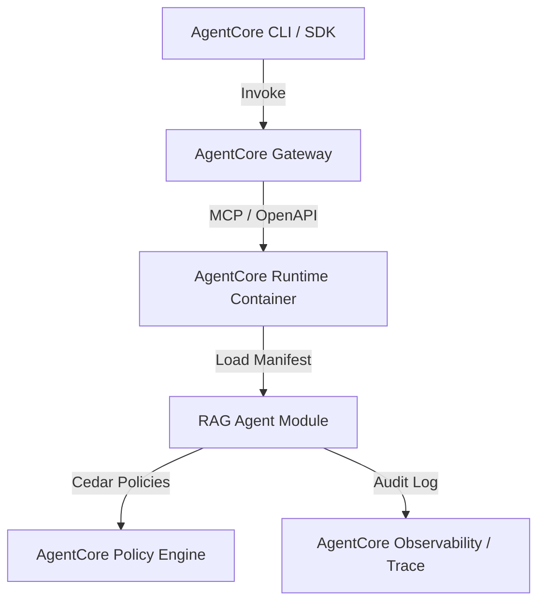

# Modular RAG Agent & AWS Bedrock Deployment Plan

This package represents a modularized version of the Retrieval-Augmented Generation (RAG) agent notebook. It separates configuration, knowledge base retrieval, tool wrappers, agent compilation, and streaming execution into structured Python modules.

---

## 📁 Package Layout

- **`config.py`**: Centralized configurations for Bedrock model IDs (`us.amazon.nova-2-lite-v1:0` and `amazon.titan-embed-text-v2:0`) and AWS default region.
- **`vector_store.py`**: Initializes the mock document knowledge base, Bedrock Embeddings, and sets up the in-memory FAISS vector database.
- **`tools.py`**: Wraps the FAISS database retrieval function as a LangChain `@tool` decoration.
- **`agent.py`**: Configures the Chat Bedrock model, injects system instructions, and compiles the agent graph with state memory checkpointing.
- **`main.py`**: Main entrypoint implementing the CLI query interface and synchronous agent execution using `agent.invoke()`.
- **`requirements.txt`**: Specifies python packages needed for execution.

---

## 🚀 Local Execution

1. **Install Dependencies**:
   ```bash
   pip install -r rag_agent/requirements.txt
   ```
2. **Set Up Credentials**:
   Ensure you have configured your AWS CLI credentials (`aws configure`) or environment variables (`AWS_ACCESS_KEY_ID`, `AWS_SECRET_ACCESS_KEY`).
3. **Run the Agent**:
   ```bash
   python -m rag_agent.main "What is FAISS and how is it used?"
   ```


---

## ☁️ Deployment Plan: AWS Bedrock & AgentCore

To transition this local prototyping modular agent into a secure, scalable production environment, we outline two deployment options:

### Option A: Managed Deployment via Native AWS Bedrock Agents
AWS Bedrock provides a fully managed service to build, deploy, and manage autonomous agents. We map our modular python classes directly into Bedrock components:



#### 1. Infrastructure Migration Map
* **Vector Store Migration**: Replace the local in-memory FAISS database with an **Amazon Bedrock Knowledge Base**. We upload our source document files to an **Amazon S3 Bucket**, and synchronize them with a vector store in Amazon Bedrock supported by **Amazon OpenSearch Serverless** (or Pinecone/Milvus).
* **Tools Migration**: Move the custom Python logic in `tools.py` to an **AWS Lambda function** registered as an **Action Group** on the Bedrock Agent.
* **Agent Core Settings**: Define the Bedrock Agent, select the orchestration model (e.g., `us.amazon.nova-2-lite-v1:0` or `anthropic.claude-3-5-sonnet-v2`), and supply the system instruction text.

#### 2. Step-by-Step Deployment Steps
1. **Prepare S3 Source**: Upload reference document files (PDF, TXT, MD) to a designated Amazon S3 bucket.
2. **Create Knowledge Base**: Navigate to Bedrock console -> *Knowledge Bases* -> *Create*. Select the S3 bucket source and choose *Quick Create* to automatically instantiate an Amazon OpenSearch Serverless vector index.
3. **Build AWS Lambda Action Group**: Package the tools script into a Lambda function. Configure the Lambda's IAM role to grant permission to call Bedrock APIs, and define an OpenAPI JSON schema describing the tool parameters.
4. **Assemble the Bedrock Agent**:
   * Go to Bedrock -> *Agents* -> *Create Agent*.
   * Select the LLM (e.g., Nova Lite/Pro) and paste the system prompt.
   * Add the S3 Knowledge Base to the agent with instructions on when to retrieve data.
   * Add the Action Group, linking it to the Lambda function and OpenAPI schema.
5. **Publish and Test**: Test the agent in the console sandbox. Click *Prepare* and *Create Alias* to publish a version. Call it from your application using the boto3 `invoke_agent` API.

---

### Option B: Enterprise Deployment via the AgentCore Runtime
If deploying on an enterprise private cloud or local cluster using your **AgentCore** orchestrator framework:



#### 1. Infrastructure Migration Map
* **Harness & Runtime**: Package the `rag_agent` python directory as a Docker container running a microservice (e.g., using FastAPI or MCP server). This service gets deployed on the **AgentCore Runtime** environment.
* **Registry**: Register the agent metadata, endpoint specifications, and MCP gateway tools in the **AgentCore Registry** using an agent manifest file.
* **Security & Policy**: Bind the agent's operations under **AgentCore Policy Engine** (using Cedar policies) to control user authorizations, and configure short/long-term context retention using **AgentCore Memory**.

#### 2. Step-by-Step Deployment Steps
1. **Create Service Wrapper**: Expose the agent via an **Model Context Protocol (MCP)** server or a simple FastAPI HTTP endpoint.
2. **Containerize**: Create a Dockerfile:
   ```dockerfile
   FROM python:3.12-slim
   WORKDIR /app
   COPY . .
   RUN pip install --no-cache-dir -r requirements.txt
   EXPOSE 8000
   CMD ["python", "-m", "rag_agent.main_server"]
   ```
3. **Register Agent Manifest**: Write a `manifest.json` describing the agent capabilities, models, registries, and MCP gateway endpoints. Register it:
   ```bash
   agentcore registry register --manifest manifest.json
   ```
4. **Deploy and Run**: Run the container within your cluster. Use the Harness CLI to verify that the agent initializes, traces outputs to **AgentCore Observability**, and enforces authorization checks.
